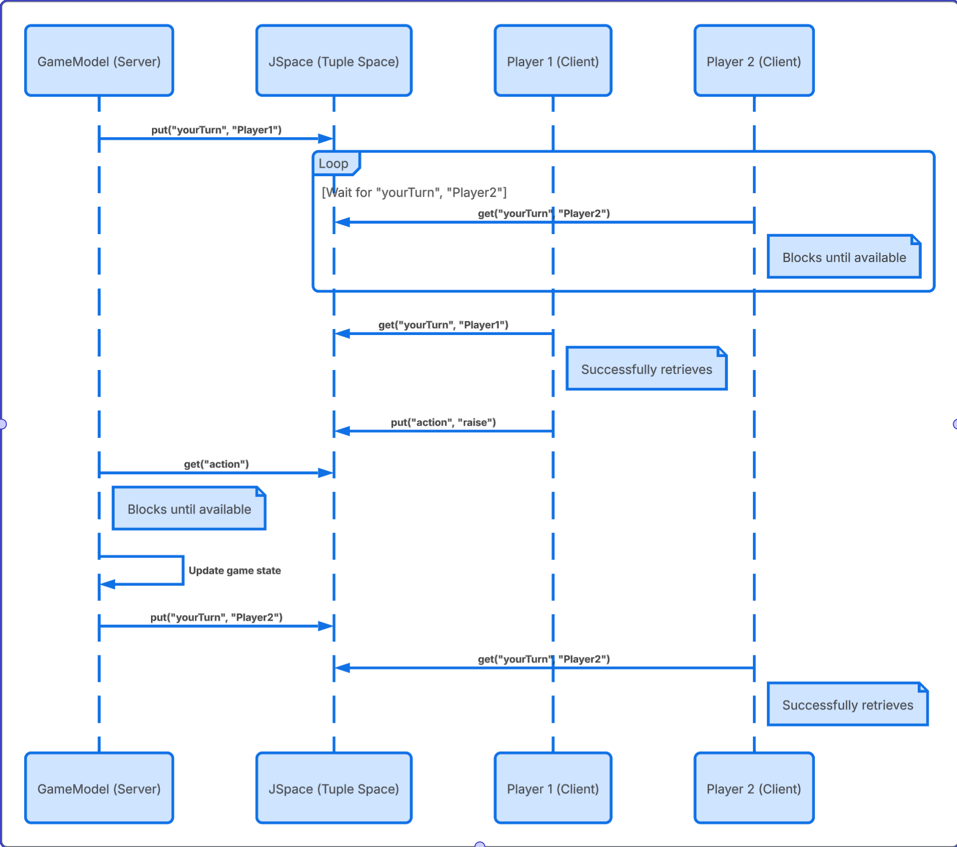

# Project 3 - Online - Poker


# Abstract

> This project implements a distributed multiplayer Texas hold'em poker game using jSpace tuple spaces for coordination and JavaFX for the graphical user interface. The system follows a model view controller paired with a client-server architecture where a central host manages game state through multiple tuple spaces, while remote clients via TCP in order to play. 
The host themselves is also a client. The host maintains several unique spaces: a random space for the deck of cards enabling arbitrary shuffling, sequential spaces for player registration and game state management. Players (clients) connect by exchanging tuples with the host, receiving unique identifiers and current game information specific to them upon entering a lobby. The lobbyManager handles these join and leave operations with locking mechanisms to prevent multiple threads from retrieving the same data concurrently.
Our game logic relies on blocking tuple operations for turn management, ensuring players all act sequentially, while queries allow players to observe the shared game without having to consume tuples. Players receive cards via personalised tuples distributed by DealerModel, with GameModel handling all bettingrounds. The determination of which hand wins is done locally using HandModel.
Our application follows a model view controller architecture, with TableModel connecting network communication and GUI updates. With threads, TableModel is able to listen for changes in the game spaces, updating the javaFX. Players can join games, place bets (fold, call, raise), and compete in Texas Hold'em poker using standard rules and hand evaluation.


# Contributors

> Project contributors:
> 
>Limejensen 	(s240617@student.dtu.dk)
> 
>BrinchyBoy 	(s246072@student.dtu.dk)
>
>ateroh 		(s245803@student.dtu.dk)


Contributions:
* All members have had equal contributions in all major aspects of the project.
* Design of main coordination aspects: 	Limejensen, BrinchyBoy and ateroh
* Coding of main coordination aspects:	Limejensen, BrinchyBoy and ateroh
* Documentation (this README file): 		Limejensen, BrinchyBoy and ateroh
* Videos: 					Limejensen, BrinchyBoy and ateroh
* Other aspects (e.g. coding of UI, etc.): 	Limejensen, BrinchyBoy and ateroh

All members of the group have worked collaboratively on every aspect of the assignment. We primarily used a mob-programming approach, meeting either in person or on Discord, where we streamed our IDEs (Visual Studio Code or IntelliJ) while working together. 
As a result, individual GitHub contributions may not fully reflect the extent of each member's involvement. While there were occasional instances where someone worked independently on a specific task, these contributions were minor and always discussed and reviewed by the group. 
Overall, our team placed a strong emphasis on close collaboration and shared problem-solving to ensure the highest possible quality of our final solution


# Demo video

> Running locally: https://youtu.be/-MWGgnr0ADg


> Running on multiple computers online video: https://youtu.be/zRn_aZdJXJg


# Main coordination challenge

We encountered several coordination challenges while building the distributed PokerGame, as for example our lobby management where we ensured atomic registration of players using a global lock pattern (lecture 2). This ensures “mutual exclusion” when multiple clients try to join simultaneously.
We also have our private game rooms where we use a private space pattern (lecture 3). The server acts as a space repository that creates new game spaces and distributes their URIs via a remote space to clients.
And lastly our Deckmanagement where we implemented randomspace (lecture 1) for random retrieval which our project relies largely on for the non deterministic nature of tuple retrieval, when multiple matching tuples exist in the form of game cards. 


The most challenging was however our distributed sequential turn management

The challenge was ensuring sequential consistency in our environment. In poker the game flow allows only one specific player to act at a time based on strict rules and order (Small blind, big blind and so on) effectively implementing a strict protocol (Lecture 4). The solution was ordered coordination via blocking operations. 
The GameModel (server) and players (clients) operate in a producer-consumer relationship (lecture 2), passing a “turn” token.
When the token has been passed the server explicitly targets the next player. It puts a directed tuple containing the specific player names:


```java
gameSpace.put("yourTurn", player.getName(), currentBet, 
player.getChips(), lastRaiseAmount);
```
 All clients possess a listener thread, but they utilize pattern matching (lecture 1) to filter the stream. A client uses a blocking operation “get” (lecture 2) to wait until a tuple matches its specific local name. This effectively pauses the client's execution until it is their turn. 

```java
Object[] t = gamessapace.get(
   new ActualField("yourTurn"), new ActualField(getMyName()), // Pattern 
   new FormalField(Integer.class), ...
```
Once the user acts (fold/call/raise), the client produces an “action” tuple back. The server, acting as a consumer (lecture 2) for this specific response had been waiting (blocking). It consumes this tuple, updates the global state and then proceeds to produce the turn for the next player.  

```java
Object[] action = gameSpace.get(new ActualField("action"), new ActualField(playerName), ...);
```


This diagram illustrates our solution to the distributed sequential turn management challenge. So to recap shortly again:

1. The server (Gamemodel) starts the round by putting a “yourturn” tuple specifically for player1 into the jspace.
2. Notice player2 on the right. They try ti take their turn immediately but because their specific tuple isnt there yet, they hit a blocking operation. They’re paused.
3. Player1 however successfully matches and retrieves their token. They perform and action like “raise” and put a action tuple back into the space.
4. The server consumes this action. Crucially the server also blocks until this response arrives ensuring it never gets ahead of the game state.
5. After updating the game state the server places a new specific token for player2 
6. Finally player2s blocking call is satisfied. They wake up and can now take their turn.

This demonstrates how we use blocking operations as a synchronization primitive to force a strict sequential protocol over an asynchronous network.

# Programming language and coordination mechanism

> This project is based on tuple space library jSpace from pSpaces(https://github.com/pSpaces). The application is written Java 21 with JavafX for the graphical user interface. 

# Installation

The requirements are as follows: you need Java 21 or higher, Maven, Javafx, jSpace Library. 

In order to run you should first clone the repository. The next step is to build the project with maven. 

Make sure you are cd’ed in PokerGame/poker and run “maven clean compile”. To run you simply run “mvn javafx:run”


__To play locally on only one computer follow these steps:__
1. Make sure ip on line 28 in PlayerClient.java is set to local host:
```java
protected String ip = “localhost”;
```
2. Make sure serverIp and serverPort is commented out or deleted from line 48 and 49.
```java
public PlayerClient(String serverIp, int serverPort, String username) {
  //serverIp = "2.tcp.eu.ngrok.io"; //"192.168.153.11"
   //serverPort = 17205;
```
3. Run the project in the poker folder with command “mvn javafx:run”

__To play over lan with multiple computers follow these steps:__
1. Set the ip on line 28 in playerclient.java to 0.0.0.0 to make sure the host computer listens to all incoming ip addresses. 
```java
protected String ip = “0.0.0.0”;
```
2. Set serverIP on line 48 to the host’s computer local ip adress. This can be found by either typing in “ifconfig” on mac and linux and “ipconfig” on windows terminal. For example:
```java
serverIp = "192.168.153.11";
```
4. Run the project in the poker folder with command “mvn javafx:run”

__To play the game online, the easiest approach is by the use of Ngrok. Simply install ngrok following the install guidelines given on the website.__

1. Go into the project fold “poker"
2. Run “ngrok tcp 9001” or a different port number from 9000 to 9999. Ngrok will give you. (may vary depending on os. Check link)
3. Change serverIP in line 48 on PlayerClient.java to whatever the ip ngrok gives, for example ```java serverIp = "2.tcp.eu.ngrok.io"; ```
4. Change serverport on line 49 in PlayerClient.java to whatever port number ngrok gives you for example ```java serverPort = 17205;```
5. Make sure ip on line 28 in PlayerClient.java is calling our getPublicIp() method. ```java protected String ip = getPublicIp();```
6. Make sure everyone has the same settings (The host does not need to follow the steps in the public PlayerClient, but no harm will be done if the values are there)

** If you have any issues, please contact our 24/7 support: +45 25 36 00 09 **

# References 
1. https://ngrok.com/docs/universal-gateway/tcp
2. https://www.cs.cornell.edu/courses/cs100/2003su/assignment5/solution/PokerHand.java
3. Lecture 1 tuple spaces 
4. Lecture 2 (Chatmanager, PlayerClient, Host)
5. Lecture 3 SpaceRepository, Gate, Remotespace 
6. Lecture 4 Loginflowinte

# IMPORTANT!

> Feel free to remove all comments of the template, but please **keep the section structure** (Project, Abstract, ...)